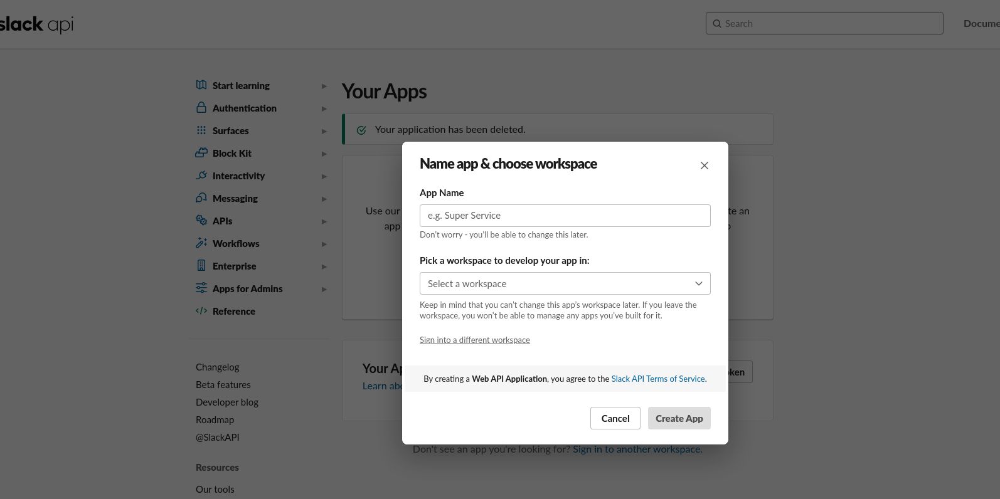
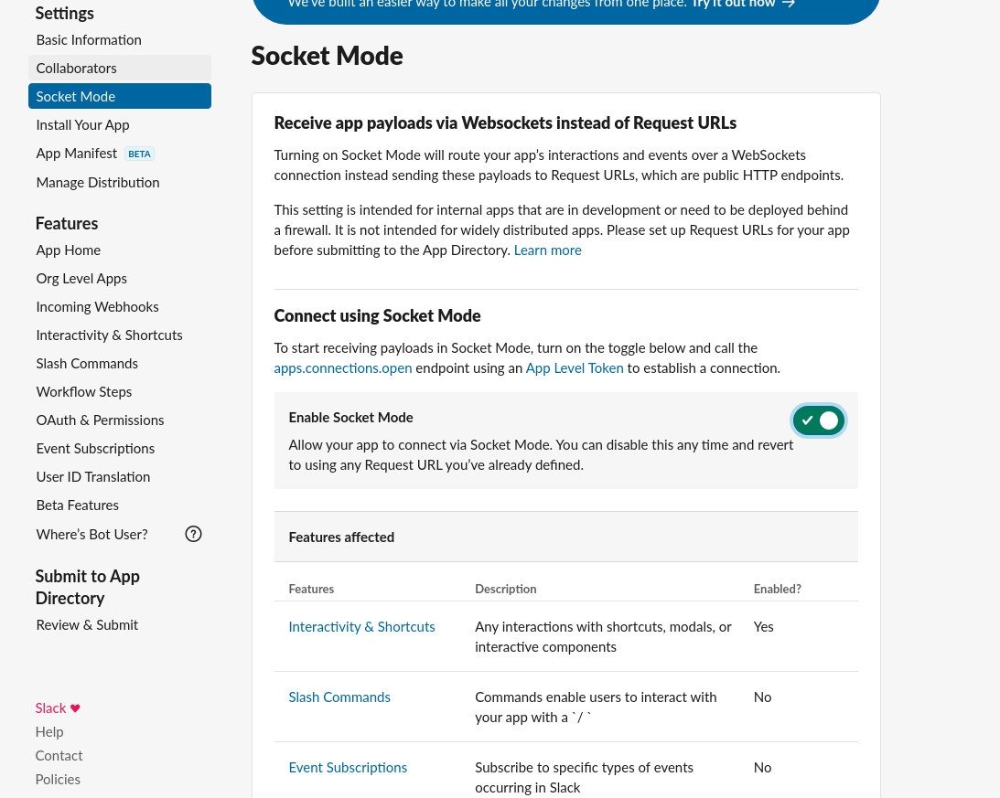
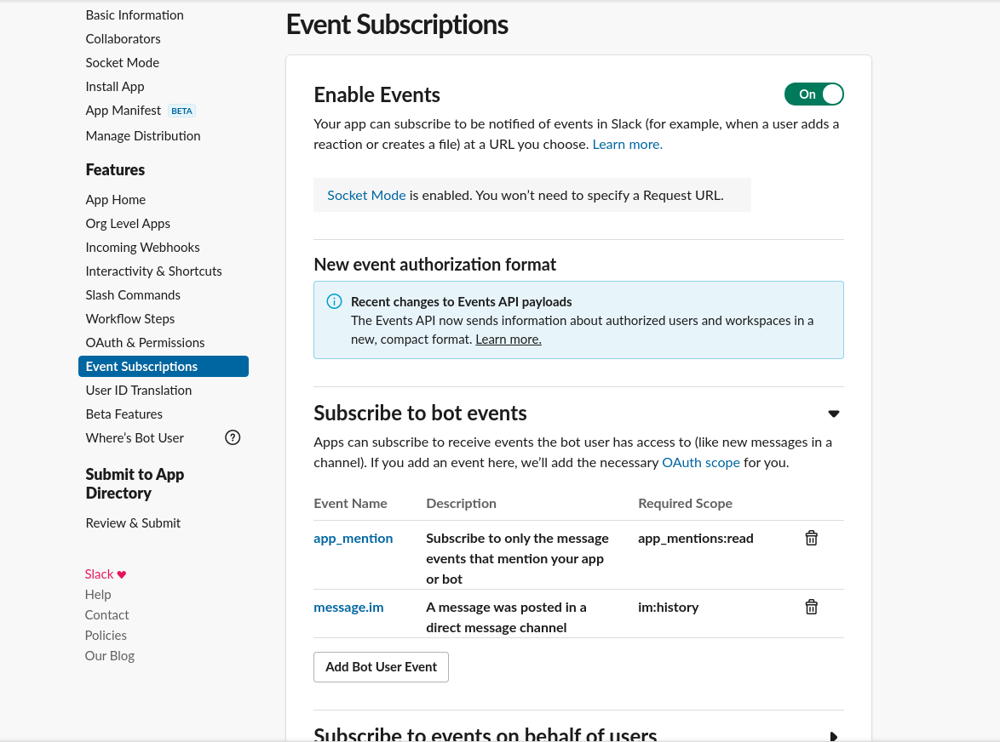
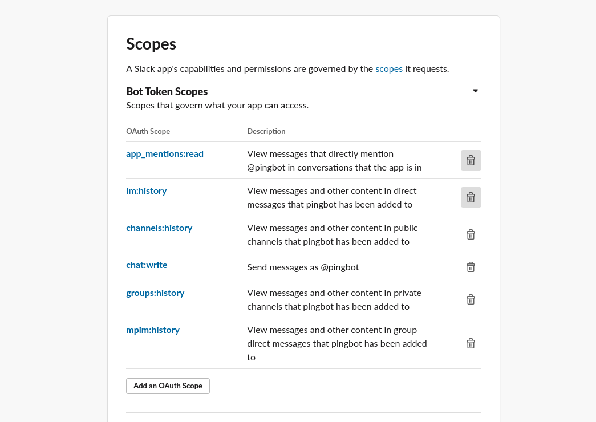
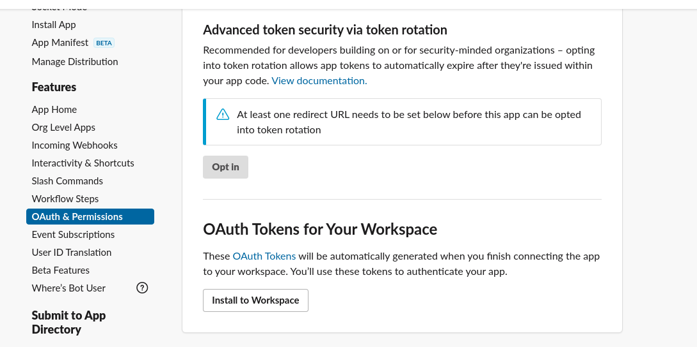
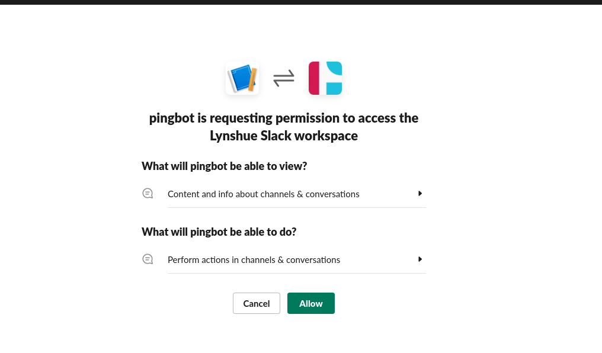
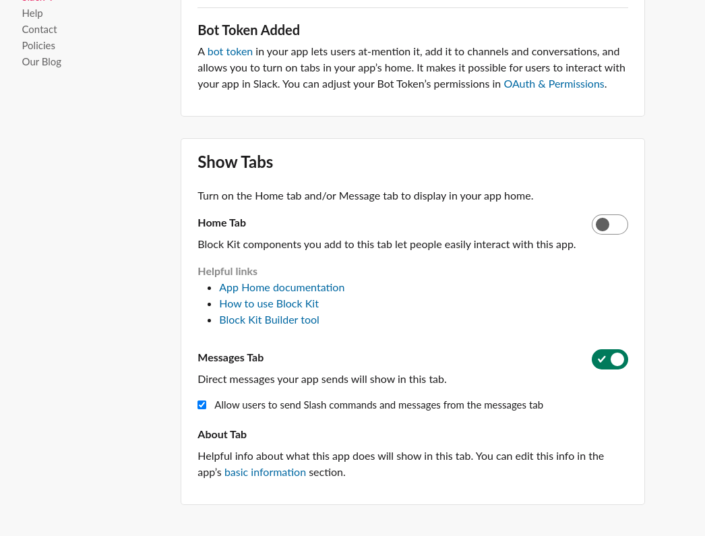
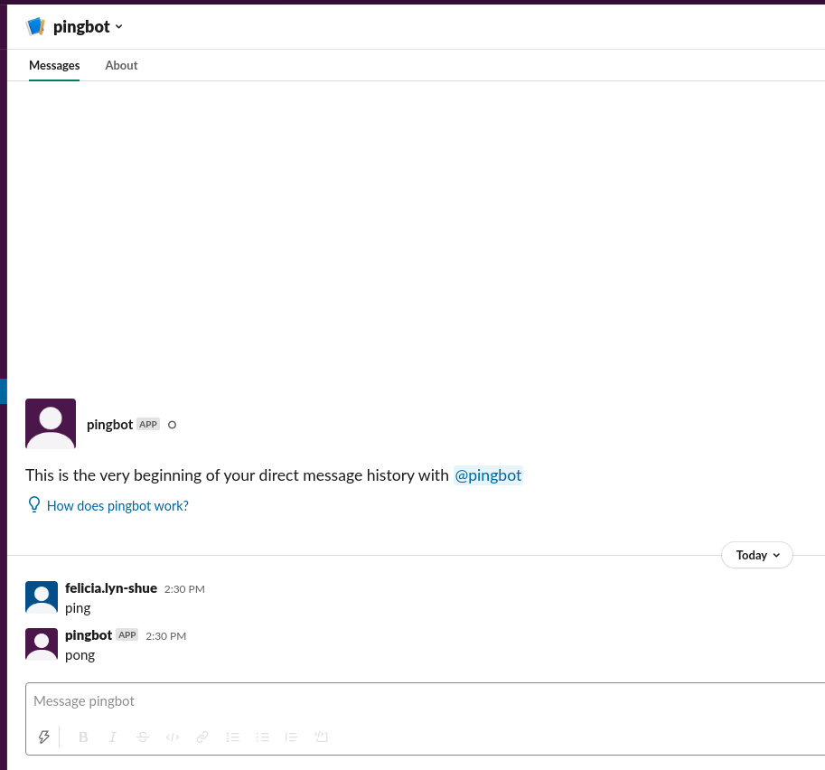
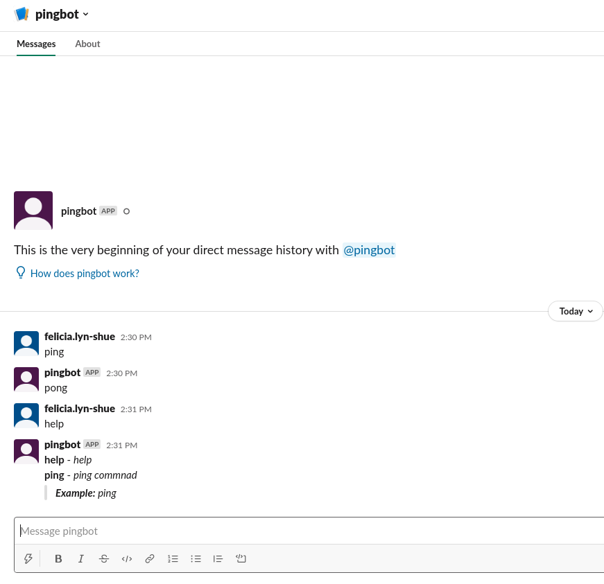

# pingbot <!-- omit in toc -->
pingbot demo for using [github.com/shomali11/slacker](https://github.com/shomali11/slacker) package
- [Creating App in Slack](#creating-app-in-slack)
- [Running the App locally](#running-the-app-locally)
- [Talking to ping bot](#talking-to-ping-bot)
# Creating App in Slack
* **Create app by going to https://api.slack.com/apps**
  

* **Turn on socket mode.**

  This will automatically create an app token will only see the token once, so save the token in a safe place like lastpass.
  

* **Enable Event Subscriptions**
  
  Add the `app_mention` and `message.im` events
  

* **Add Oauth Scopes**
  
  Go to **Oauth & Permissions>Scopes**
  

* **Install App to Workspace**
  

  

* **Grab the Bot User OAuth Token**


* **Allow direct messages to bot**

  Go to **App Home** and scroll down to **Show Tabs** and check the box allowing direct messages

  

# Running the App locally
Set set env vars for the slack bot and app tokens
```bash
$ export SLACK_BOT_TOKEN=<YOUR_BOT_TOKEN>
$ export SLACK_APP_TOKEN=<YOUR_APP_TOKEN>
```

Run the pingbot
```bash
$ go run main.go
Connecting to Slack with Socket Mode.
Connected to Slack with Socket Mode.
Connected as App ID A02QYSEJ6HJ
```

# Talking to ping bot
  

  